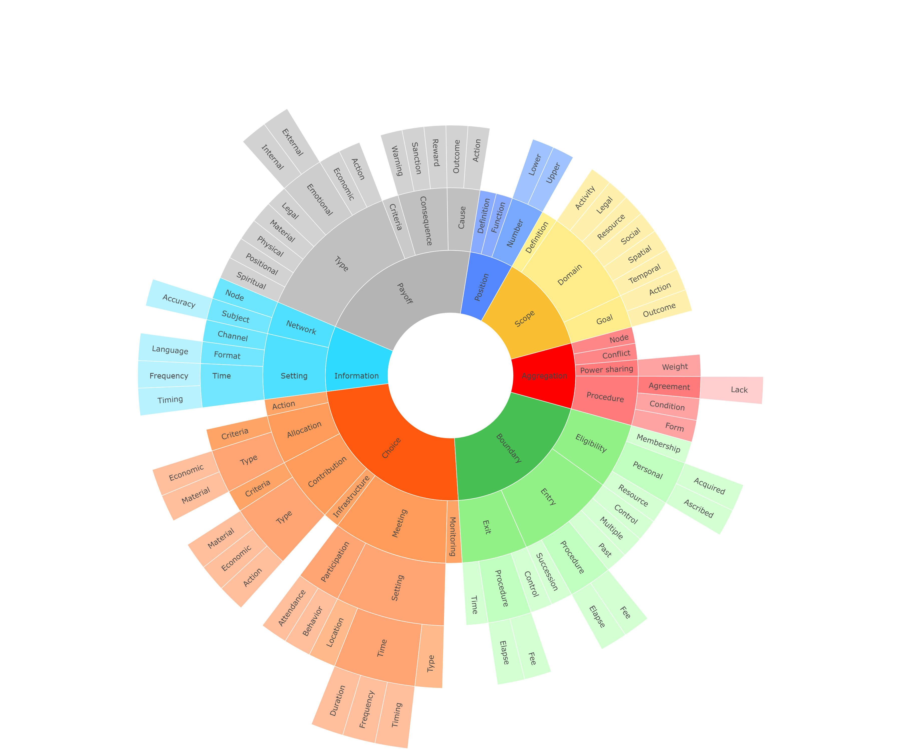

The **Rules Taxonomy** provides a detailed classification of the seven types of rules (aggregation, boundary, choice, information, payoff, position, scope) proposed by Ostrom and Crawford (2005), breaking them down into specific subtypes.

The taxonomy was developed in four stages:
1. **Version 1:** Based on the original definitions of rule types.

2. **Version 2:** Informed by a systematic review of scientific studies that code rules.

3. **Version 3:** Refined through the codification of four written regulations from common-pool resource systems.

4. **Version 4:** Finalized with a mutual exclusivity check to ensure each rule fits into only one subtype.

The file *2 RULES TAXONOMY V4.0.md* presents Version 4 of the taxonomy, including the name, acronymn, hierarchy, and description  of each subtype. 

The folder *OLD VERSIONS* contains the same information for previous versions. The *OLD VERSIONS* folder also includes a description of the changes made from Version 3 to Version 4 of the taxonomy.
