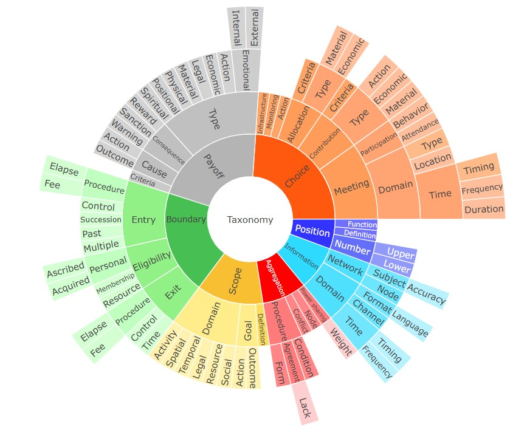

# RULES TAXONOMY

This taxonomy provides a detailed classification of the seven types of rules proposed by Ostrom and Crawford (2005), breaking them down into specific subtypes. Click on the figure below to explore the full range of subtypes.

The taxonomy of rules was developed within the framework of the Resilient Rules project, funded by the European Research Council (ERC, RESILIENT RULES, 101044225). For more information, see [Resilient Rules](https://resilientrules.com) 

*Views and opinions expressed are however those of the author(s) only and do not necessarily reflect those of the European Union or the European Research Council Executive Agency. Neither the European Union nor the granting authority can be held responsible for them.* 
